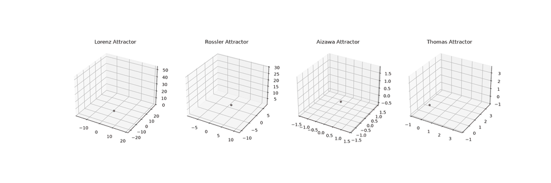
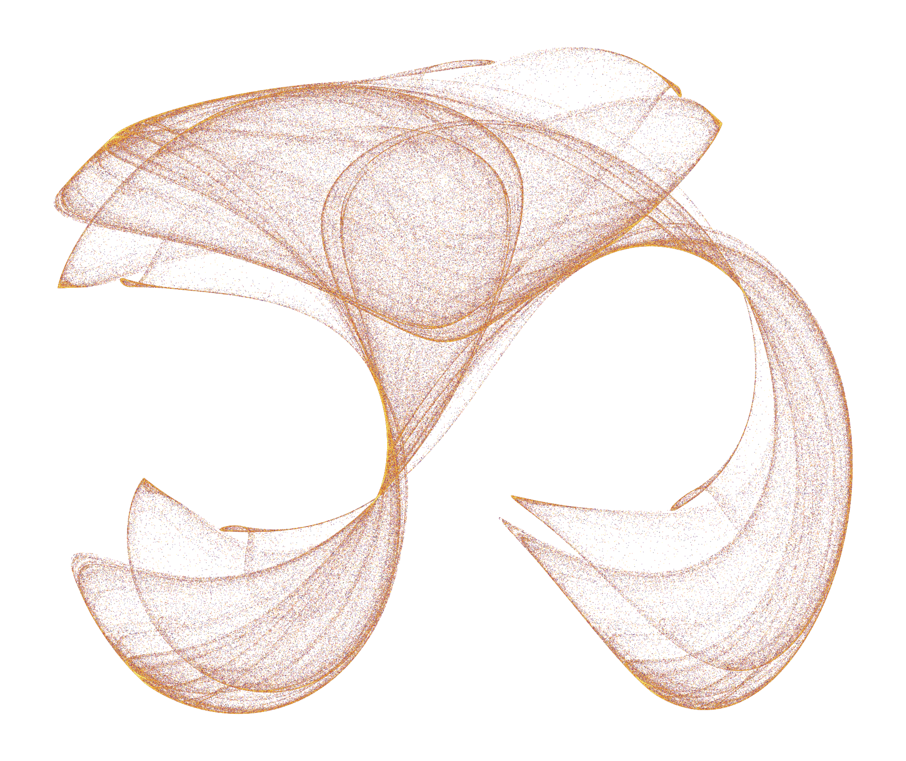

# Strange Attractors

Chaotic systems that never settle, never repeat, and never escape. Four
continuous attractors rendered as one synchronized animation, plus one
discrete map that needed a completely different approach.



Left to right: **Lorenz** (the classic two-lobe butterfly), **Rössler** (a
single band that winds and folds), **Aizawa** (a layered shell), and
**Thomas** (softer, trig-based rather than polynomial).

All four are continuous systems: three coupled differential equations,
Euler-integrated into a trajectory, animated as a moving point tracing a
connected path.

## Clifford



Clifford is a discrete map, not a continuous system:

```
x' = sin(a*y) + c*cos(a*x)
y' = sin(b*x) + d*cos(b*y)
```

There is no derivative and no time step. Consecutive points can land
anywhere in the plane, so there is no path to trace and nothing to
animate. The shape emerges statistically instead, from plotting half a
million points and seeing where they pile up.

## Structure

Two functions do the work, so each new continuous attractor is a step
function plus one line:

```python
integrate(step_fn, initial, dt, n_steps)
animate_side_by_side([(positions, title, speed), ...])
```

`speed` scales how fast each attractor draws relative to the others, since
they need different step counts but share one animation clock.

## Run it

```
pip install numpy matplotlib pillow
python strange.py
```

Writes `attractors.gif` and `clifford.png`.

Render time scales directly with frame count, since every frame has to be
rasterized and encoded up front. `frame_step` is the lever: raising it
builds fewer frames without making playback choppier, because `fps`
controls speed independently.

Full writeup: [Never repeating, never leaving](https://sslog.dpdns.org/never-repeating-never-leaving.html)
